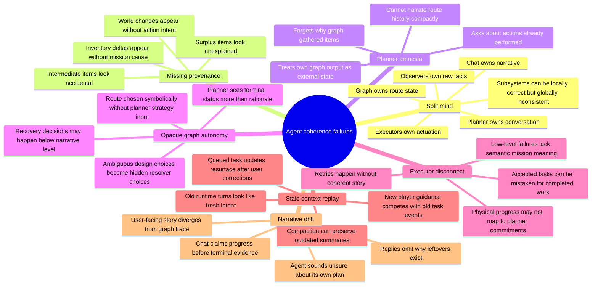

# Airicraft Agent Coherence Failure Modes

## Scope

This document intentionally lists failure modes only. It does not propose fixes yet. The purpose is to keep the architecture discussion focused before choosing which problems need a shared self-model, ledger, graph changes, planner prompt changes, or executor changes.

## Failure Mode Details

### Split Mind

Airicraft currently has several valid internal owners: planner, action graph, task executors, observers, and dialogue. Each can be locally correct while the overall agent appears fragmented. The symptom is not one broken subsystem; it is missing shared identity across subsystems.

Example: the graph may decide to gather logs for an iron pickaxe route, the executor may successfully mine them, and inventory observers may report the logs. If the planner later treats those logs as unexplained inventory, the agent appears to have forgotten its own intent.

### Missing Provenance

Raw inventory and world facts do not always explain why they changed. The planner can see that items exist or blocks changed, but not whether those changes came from the current mission, a prior mission, another player, passive pickup, or unrelated environment state.

This is especially risky for intermediate and surplus items. Planks, sticks, furnaces, raw ore, coal, buckets, hoes, seeds, and farmland can all be meaningful route artifacts. Without provenance, they can look accidental or confusing.

### Planner Amnesia

The planner owns the user-facing self-narrative, but it may not receive a compact summary of the graph's route and execution history. It can then reason only from current facts and recent chat, losing the reason behind earlier graph decisions.

The failure is not that the planner failed to choose a low-level step. The failure is that the planner cannot reliably say, "I gathered this because it was part of my route to the current goal."

### Opaque Graph Autonomy

The action graph is good for deterministic dependency chains, but some tasks contain real strategy choices. Farm placement, terrain correction, multiplayer cooperation, and destructive block edits are not only symbolic dependency problems.

If the graph makes these choices internally, the planner may see only status and terminal results, not the rationale. That keeps the planner from owning strategy, asking the user, or explaining why a chosen path makes sense.

### Executor Disconnect

Task executors produce physical progress and low-level failures, but those outcomes are not always lifted into mission-level meaning. A failed `use_block`, navigation failure, or crafting retry may be technically accurate while still failing to explain what it means for the mission.

This makes recovery hard to narrate. The agent may retry, replan, or stall without a clear statement like, "The hoe interaction failed because the target was one block too low for the intended flat farm."

### Stale Context Replay

Queued task updates can outlive the context that made them relevant. After a user correction, older runtime or self turns may replay and compete with the new instruction. Compaction can make this worse if it preserves outdated task summaries as still-active context.

The visible symptom is the agent responding to old task events instead of the latest player guidance. The underlying issue is that task updates need freshness, ownership, and supersession semantics.

### Narrative Drift

Chat can diverge from execution truth. The agent may claim progress before terminal evidence, omit why leftovers exist, or give a user-facing explanation that does not match the graph trace.

This damages trust even when execution eventually succeeds. A coherent agent needs its visible narrative to be derived from the same mission state that drives graph execution and executor progress.
